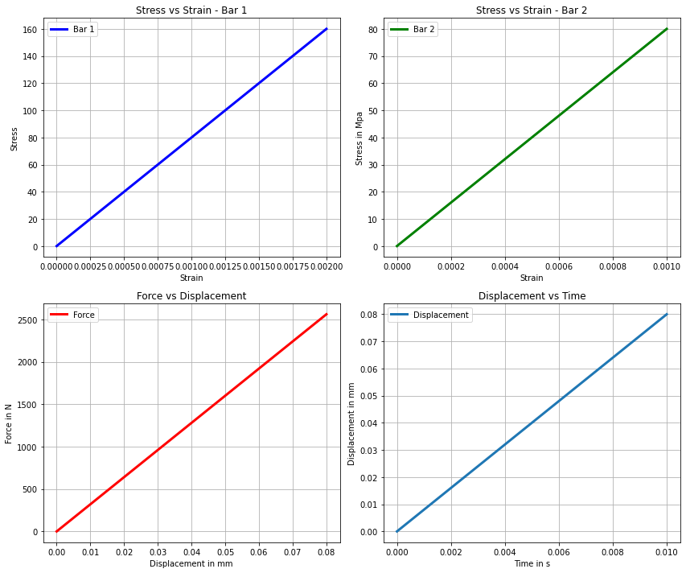
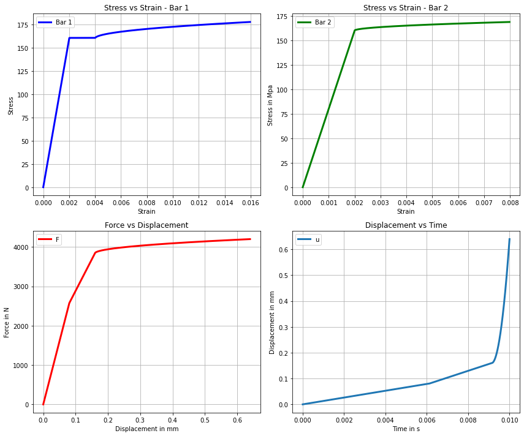
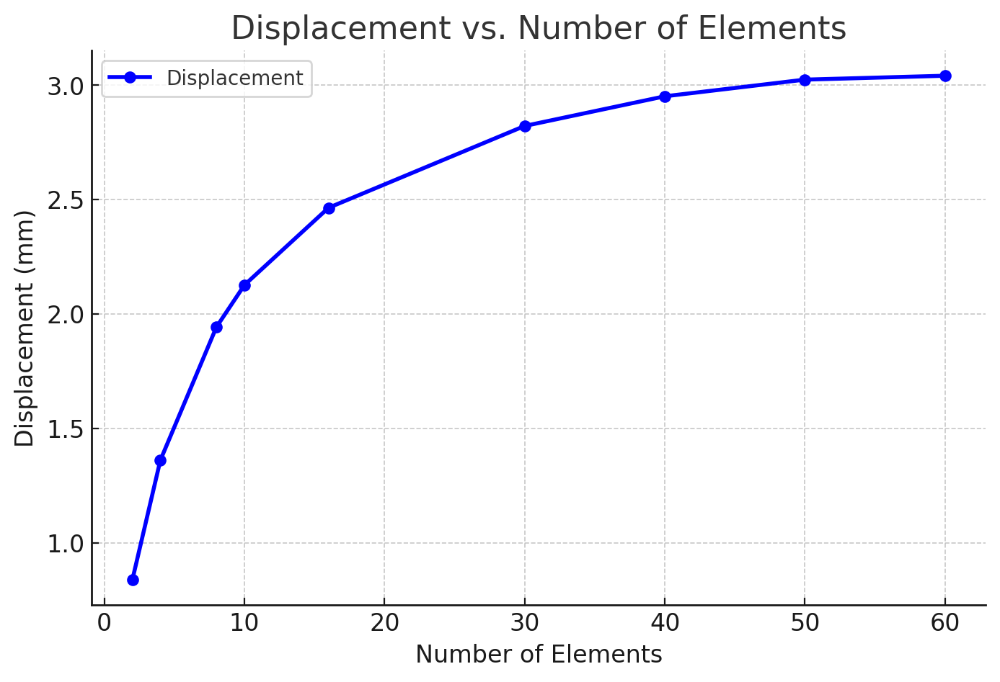

# Nonlinear Finite Element Analysis of a 1D Viscoplastic Bar

A self-written **nonlinear finite element solver in Python** for the incremental
analysis of a one-dimensional two-segment bar with rate-dependent viscoplastic
material behavior.

The project implements the complete nonlinear finite-element workflow from the
material level to the global structural response.

**Nonlinear FEM · Computational Mechanics · Viscoplasticity · Newton-Raphson · Constitutive Modeling · Python**

---

## Overview

This project develops a nonlinear finite-element model of a one-dimensional bar
composed of two sections with different cross-sectional areas and lengths.

Both outer ends of the bar are fixed, while an external force is applied at the
junction between the two sections.

The response is solved incrementally using a Newton-Raphson procedure.

The implementation includes:

- two-node linear bar elements,
- linear Lagrange shape functions,
- strain-displacement formulation,
- two-point Gauss quadrature,
- rate-dependent viscoplastic material behavior,
- incremental constitutive updates,
- tangent material stiffness,
- element internal-force calculation,
- element tangent stiffness,
- global finite-element assembly,
- Dirichlet boundary conditions,
- load/time stepping,
- Newton-Raphson equilibrium iterations,
- convergence checks,
- stress-strain post-processing,
- force-displacement response,
- discretization/convergence investigation.

---

# Mechanical Problem

The structural model consists of two bar segments connected at an internal node.

```text
Fixed                                                Fixed
  |                                                    |
  |------ Bar 1 ------|------ Bar 2 ------------------|
                      ↑
                 Applied Force
```

The two sections have different geometrical properties.

| Property | Bar 1 | Bar 2 |
|---|---:|---:|
| Length | 40 mm | 80 mm |
| Cross-sectional area | 8 mm² | 16 mm² |
| Number of elements | 5 | 5 |

The external force is applied at the common node between the two bar sections.

Because the cross-sectional areas are different, the two sections develop
different stress states under the applied load.

---

# Finite Element Formulation

## Element Displacement Field

Each one-dimensional element consists of two nodes.

The displacement field inside an element is interpolated using linear shape
functions.

```math
u(\xi) = N_1(\xi)u_1 + N_2(\xi)u_2
```

The shape functions are

```math
N_1(\xi) = \frac{1}{2}(1-\xi)
```

and

```math
N_2(\xi) = \frac{1}{2}(1+\xi)
```

The element displacement vector is

```math
\mathbf{u}_e =
\begin{bmatrix}
u_1 \\
u_2
\end{bmatrix}
```

---

## Strain-Displacement Relation

For a one-dimensional bar,

```math
\varepsilon = \frac{du}{dx}
```

Using the finite-element interpolation,

```math
\varepsilon = \mathbf{B}\mathbf{u}_e
```

where

```math
\mathbf{B} = \frac{d\mathbf{N}}{dx}
```

The mapping from the natural coordinate to the physical coordinate is described
by the element Jacobian

```math
J = \frac{dx}{d\xi}
```

---

# Material Model

The constitutive model separates the total strain into elastic and inelastic
contributions.

```math
\varepsilon = \varepsilon^e + \varepsilon^p
```

The one-dimensional stress relation is

```math
\sigma = E(\varepsilon-\varepsilon^p)
```

The material parameters used in the current implementation are:

| Parameter | Value |
|---|---:|
| Young's modulus `E` | 80000 MPa |
| Reference stress `σy` | 160 MPa |
| Viscoplastic parameter `η` | 50 |
| Rate exponent `m` | 1 |

---

# Rate-Dependent Viscoplastic Response

The code first evaluates an elastic trial stress.

```math
\sigma_{\mathrm{trial}} = E(\varepsilon-\varepsilon_p)
```

A viscoplastic correction becomes active when the trial stress exceeds the
reference stress.

The overstress measure implemented in the code is

```math
\lambda =
\left[
\max\left(
0,
\frac{|\sigma|}{\sigma_y}-1
\right)
\right]^m
```

The viscoplastic strain evolution follows the form

```math
\dot{\varepsilon}_p
=
\eta \lambda \, \mathrm{sgn}(\sigma)
```

where `η` controls the rate of inelastic evolution.

---

# Elastic Step

If the trial state satisfies

```math
|\sigma_{\mathrm{trial}}| \le \sigma_y
```

no viscoplastic correction is introduced.

The updated stress is therefore

```math
\sigma = \sigma_{\mathrm{trial}}
```

and the viscoplastic strain remains unchanged.

```math
\varepsilon_p^{n+1} = \varepsilon_p^n
```

The tangent modulus in the elastic regime is

```math
C_t = E
```

---

# Active Viscoplastic Step

For an active viscoplastic step, the stress is corrected according to the
incremental relation implemented in `PVL.py`.

For the current case with `m = 1`,

```math
\sigma^{n+1}
=
\frac{
\left(
\sigma_{\mathrm{trial}}
+
E\Delta t \eta \, \mathrm{sgn}(\sigma_{\mathrm{trial}})
\right)\sigma_y
}{
\sigma_y + E\Delta t\eta
}
```

The overstress is then recalculated using the corrected stress.

```math
\lambda^{n+1}
=
\max\left(
0,
\frac{|\sigma^{n+1}|}{\sigma_y}-1
\right)^m
```

The viscoplastic strain is updated incrementally.

```math
\varepsilon_p^{n+1}
=
\varepsilon_p^n
+
\Delta t \eta \lambda^{n+1}
\mathrm{sgn}(\sigma^{n+1})
```

---

# Tangent Material Stiffness

The nonlinear structural solution requires a tangent modulus.

For an elastic material state,

```math
C_t = E
```

For the active viscoplastic response used in the implementation,

```math
C_t
=
\frac{
E\sigma_y
}{
\sigma_y + E\Delta t\eta
}
```

This tangent modulus is used in the element tangent stiffness matrix and
therefore directly enters the Newton-Raphson solution.

---

# Element Formulation

At each Gauss point, the code evaluates:

- element strain,
- constitutive response,
- stress,
- updated viscoplastic strain,
- tangent modulus.

The element internal-force vector is

```math
\mathbf{f}_{\mathrm{int}}^e
=
\int_{\Omega_e}
\mathbf{B}^T \sigma A \, dx
```

The element tangent stiffness matrix is

```math
\mathbf{K}_T^e
=
\int_{\Omega_e}
\mathbf{B}^T C_t \mathbf{B} A \, dx
```

where `A` is the cross-sectional area of the current bar section.

---

# Numerical Integration

Element quantities are integrated using **two-point Gauss quadrature**.

The Gauss points are

```math
\xi_1 = -\frac{1}{\sqrt{3}}
```

and

```math
\xi_2 = \frac{1}{\sqrt{3}}
```

with weights

```math
w_1 = w_2 = 1
```

At each integration point, the solver computes the material response and adds
the corresponding contribution to the element stiffness and internal-force
vector.

---

# Global Finite Element Assembly

Element matrices and vectors are assembled into the global nonlinear system.

The global tangent stiffness matrix has the form

```math
\mathbf{K}_T
=
\sum_e
\mathbf{A}_e^T
\mathbf{K}_T^e
\mathbf{A}_e
```

The global internal-force vector is

```math
\mathbf{F}_{\mathrm{int}}
=
\sum_e
\mathbf{A}_e^T
\mathbf{f}_{\mathrm{int}}^e
```

where `A_e` represents the element-to-global degree-of-freedom mapping.

---

# Nonlinear Equilibrium

At each load increment, equilibrium requires

```math
\mathbf{R}
=
\mathbf{F}_{\mathrm{int}}
-
\mathbf{F}_{\mathrm{ext}}
=
\mathbf{0}
```

Because the material response depends on the current deformation state, this
system is nonlinear.

The equilibrium equations are therefore solved iteratively.

---

# Newton-Raphson Solution

At Newton iteration `i`, the displacement correction is obtained from

```math
\mathbf{K}_T^{(i)}
\Delta\mathbf{u}^{(i)}
=
-\mathbf{R}^{(i)}
```

The displacement vector is then updated.

```math
\mathbf{u}^{(i+1)}
=
\mathbf{u}^{(i)}
+
\Delta\mathbf{u}^{(i)}
```

After updating the displacement, the element strains, material state, tangent
stiffness, internal forces, and global residual are recalculated.

The process is repeated until the convergence criterion is satisfied.

---

# Convergence Criteria

The implementation monitors both the equilibrium residual and the displacement
correction.

The residual norm is

```math
\|\mathbf{R}\|_{\infty}
```

and the displacement-correction norm is

```math
\|\Delta\mathbf{u}\|_{\infty}
```

The current code uses a tolerance of

```math
0.005
```

with a maximum of

```math
10
```

Newton iterations per load increment.

---

# Boundary Conditions

Both external ends of the complete two-segment bar are fixed.

```math
u_{\mathrm{left}} = 0
```

and

```math
u_{\mathrm{right}} = 0
```

The constrained degrees of freedom are eliminated from the global system before
solving the equilibrium equations.

The external load is applied at the node connecting the two bar segments.

---

# Incremental Loading

The applied force is increased linearly with time.

```math
F(t)
=
\frac{F_{\max}}{t_{\mathrm{tot}}}t
```

The current simulation uses:

| Parameter | Value |
|---|---:|
| Maximum load `Fmax` | 4200 N |
| Total loading time | 0.01 s |
| Number of increments | 4200 |

The time increment is therefore determined from the total loading time and the
number of increments.

---

# Numerical Solution Workflow

The complete nonlinear finite-element procedure implemented in `PVL.py` is:

```text
Input geometry and material parameters
                 │
                 ▼
        Generate 1D FE mesh
                 │
                 ▼
 Initialize displacement and
 viscoplastic state variables
                 │
                 ▼
      Start load increment
                 │
                 ▼
   Start Newton-Raphson loop
                 │
                 ▼
       Loop over elements
                 │
      ┌──────────┴──────────┐
      │                     │
      ▼                     ▼
Extract element      Determine material
displacement         and geometry data
      │                     │
      └──────────┬──────────┘
                 ▼
          Compute B-matrix
                 │
                 ▼
          Calculate strain
                 │
                 ▼
       Call material routine
                 │
       ┌─────────┴─────────┐
       ▼                   ▼
   Stress update      Tangent modulus
       │                   │
       └─────────┬─────────┘
                 ▼
     Element stiffness and
       internal-force vector
                 │
                 ▼
          Global assembly
                 │
                 ▼
      Apply boundary conditions
                 │
                 ▼
       Compute global residual
                 │
                 ▼
 Solve for displacement correction
                 │
                 ▼
       Update displacements
                 │
                 ▼
        Check convergence
           │           │
         No│           │Yes
           ▼           ▼
      Next Newton    Store step
       iteration      results
                       │
                       ▼
                Next load step
```

---

# Numerical Results

## Elastic Response

<p align="center">
  
</p>

The elastic response provides a reference case for evaluating the structural
finite-element implementation before activating the nonlinear material
response.

---

## Viscoplastic Response

<p align="center">
  
</p>

The nonlinear solution captures the transition from the initial elastic response
to the rate-dependent viscoplastic regime.

The code independently tracks the stress and strain histories of both bar
sections.

---

## Discretization Study

<p align="center">
  
</p>

The influence of the finite-element discretization on the calculated response is
investigated by changing the number of elements.

This provides a numerical check that the computed structural response is not an
artifact of a particular mesh choice.

---

# Quantities Evaluated by the Solver

During the incremental analysis, the program calculates and stores:

- global nodal displacements,
- displacement at the loaded junction,
- element strain,
- stress in Bar 1,
- stress in Bar 2,
- viscoplastic strain,
- material tangent modulus,
- element internal forces,
- global internal-force vector,
- global residual vector,
- Newton displacement corrections.

The implemented post-processing produces:

- stress-strain response for Bar 1,
- stress-strain response for Bar 2,
- force-displacement response,
- displacement-time response.

---

# Code Organization

The solver is divided into three main computational levels.

## 1. Material Routine

```python
material(strain, dt, ep)
```

The material routine evaluates:

- trial stress,
- elastic or viscoplastic state,
- stress correction,
- updated viscoplastic strain,
- tangent material stiffness.

---

## 2. Element Routine

```python
elementStiffness(u_e, x, A, dt, ep)
```

The element routine evaluates:

- shape functions,
- shape-function derivatives,
- Jacobian,
- B-matrix,
- strain,
- Gauss-point material response,
- element tangent stiffness,
- element internal-force vector.

---

## 3. Global Solver

```python
main()
```

The global solution routine handles:

- load stepping,
- finite-element assembly,
- boundary conditions,
- Newton-Raphson iterations,
- convergence checks,
- displacement updates,
- result storage,
- post-processing.

The implementation therefore follows the standard nonlinear FEM hierarchy:

```text
Constitutive Model
       │
       ▼
 Element Routine
       │
       ▼
 Global Assembly
       │
       ▼
Nonlinear Equilibrium
       │
       ▼
 Newton-Raphson Solver
```

---

# Current Model Parameters

The current `PVL.py` implementation uses:

| Parameter | Value |
|---|---:|
| Young's modulus `E` | 80000 MPa |
| Reference stress `σy` | 160 MPa |
| Viscoplastic parameter `η` | 50 |
| Rate exponent `m` | 1 |
| Bar 1 area `A1` | 8 mm² |
| Bar 2 area `A2` | 16 mm² |
| Bar 1 length `L1` | 40 mm |
| Bar 2 length `L2` | 80 mm |
| Maximum external force | 4200 N |
| Total loading time | 0.01 s |
| Load/time increments | 4200 |
| Elements in Bar 1 | 5 |
| Elements in Bar 2 | 5 |
| Maximum Newton iterations | 10 |
| Newton tolerance | 0.005 |

---

# Repository Structure

```text
NLFEM/
│
├── README.md
│
├── PVL.py
│   └── Nonlinear finite-element solver
│
├── NLFEM_report.pdf
│   └── Detailed project documentation
│
├── Elastic_curve.png
│   └── Elastic reference response
│
├── Plastic.png
│   └── Viscoplastic response
│
└── Convergense_with_eleme.png
    └── Finite-element discretization study
```

---

# Requirements

The implementation requires:

- Python 3
- NumPy
- Matplotlib

Install the required Python packages with:

```bash
pip install numpy matplotlib
```

---

# Running the Solver

From the `NLFEM` directory, run:

```bash
python PVL.py
```

The program performs the complete incremental nonlinear analysis and produces the
stress-strain, force-displacement, and displacement-time plots.

---

# Technical Report

Further documentation of the project is available in:

**[NLFEM_report.pdf](NLFEM_report.pdf)**

---

# Skills Demonstrated

This project demonstrates implementation of important concepts in nonlinear
computational mechanics:

- finite-element formulation from first principles,
- nonlinear structural equilibrium,
- Newton-Raphson iteration,
- constitutive material integration,
- viscoplastic internal-variable evolution,
- tangent material stiffness,
- numerical quadrature,
- element-level calculations,
- global finite-element assembly,
- incremental loading,
- nonlinear convergence checking,
- mesh/discretization analysis,
- scientific programming using Python and NumPy.

---

# Author

**Kartik Suresh Tandel**

M.Sc. Computational Materials Science  
TU Bergakademie Freiberg

### Areas of Interest

- Computational Mechanics
- Nonlinear Finite Element Analysis
- Constitutive Material Modeling
- Plasticity and Viscoplasticity
- Structural Simulation
- Numerical Methods
- Scientific Computing