# Phase-Field Modeling of Dendritic Solidification in FEniCSx

Finite-element implementation and numerical verification of phase-field models for
dendritic solidification using **FEniCSx / DOLFINx**, **PETSc**, **MPI**, and **Python**.

**Computational Materials Science · Phase-Field Modeling · Finite Element Method · Nonlinear FEM · Scientific Computing**

---

## Overview

Dendritic microstructures develop during the solidification of metals and alloys as a
result of the interaction between phase transformation, diffusion, interface energy,
and interfacial anisotropy.

Explicit tracking of the solid-liquid interface becomes increasingly difficult once
complex morphologies and dendritic branches develop. The **phase-field method**
avoids explicit interface tracking by introducing a continuous order parameter
$\phi$:

$$
\phi =
\begin{cases}
+1, & \text{solid},\\
-1, & \text{liquid}.
\end{cases}
$$

Intermediate values of $\phi$ represent the diffuse solid-liquid interface.

The aim of this project is to implement the governing phase-field equations using
the **finite element method in FEniCSx**, verify each part of the numerical
formulation independently, and finally simulate anisotropic dendritic growth.

The model development is based on the formulation studied in the reference paper:

> **Modeling of dendritic solidification and numerical analysis of the phase-field approach to model complex morphologies in alloys**

The implementation is developed progressively rather than directly solving the full
dendritic problem. Each physical contribution is introduced and verified separately
before being combined into the final solver.

---

# Project Highlights

- Phase-field implementation from the governing equations
- Finite-element discretization using **FEniCSx / DOLFINx**
- First-order **Lagrange finite elements**
- Mixed $P_1 \times P_1$ formulation for $\phi$ and $u$
- Fully implicit **Backward-Euler time integration**
- Nonlinear solution using **Newton's method**
- Consistent Jacobian generated using **UFL automatic differentiation**
- PETSc-based linear and nonlinear solution
- MPI-compatible implementation
- Natural homogeneous Neumann boundary conditions
- Diffuse-interface gradient-energy formulation
- Coupled phase-field and diffusion formulation
- Four-fold anisotropic interfacial energy
- Dendrite-tip tracking and velocity evaluation
- Energy and dissipation verification
- Enthalpy-balance verification
- Boundary-condition verification
- Decoupling tests for individual governing equations
- Representative numerical results and post-processing scripts

---

# Dendritic Growth

The final stage introduces four-fold interfacial anisotropy to an initially circular
solid seed.

<p align="center">
  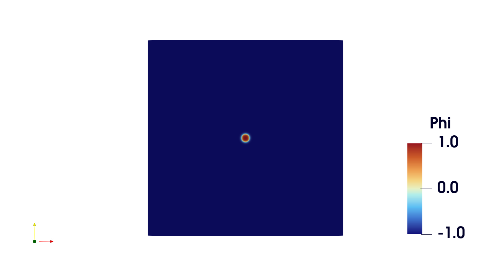
  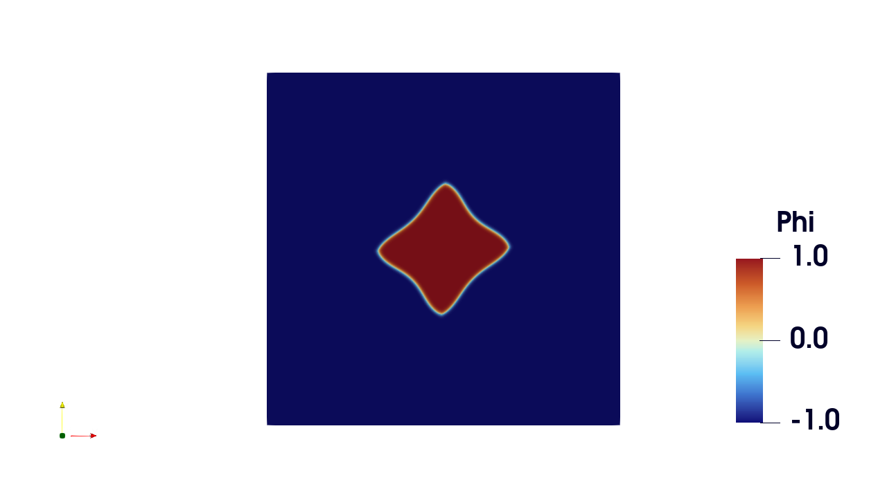
  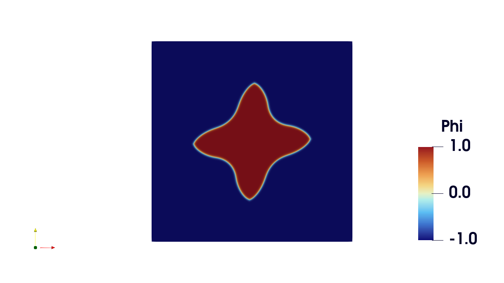
</p>

<p align="center">
  <b>Evolution of the phase field from the initial seed to an anisotropic dendritic morphology</b>
</p>

The solid-liquid interface is approximately represented by the zero level set

$$
\phi = 0.
$$

---

# Physical Model

## Bulk Free Energy

The local bulk free-energy density used in the implementation is

$$
f(\phi,u)
=
-\frac{1}{2}\phi^2
+\frac{1}{4}\phi^4
+\zeta u\phi
\left(
1-\frac{2}{3}\phi^2+\frac{1}{5}\phi^4
\right).
$$

The first two terms form the double-well potential associated with the two bulk
phases.

The derivative entering the phase-field equation is

$$
\frac{\partial f}{\partial \phi}
=
-\phi
+\phi^3
+\zeta u
\left(
1-2\phi^2+\phi^4
\right).
$$

The parameter $\zeta$ controls coupling between the phase field and the
temperature/undercooling field.

---

## Gradient Energy

A gradient contribution is introduced to assign energy to the diffuse
solid-liquid interface.

For the isotropic formulation, the free-energy functional can be written in the
form

$$
\Pi[\phi,u]
=
\int_{\Omega}
\left[
f(\phi,u)
+
\frac{\lambda_0^2}{2}
|\nabla\phi|^2
\right]
\,d\Omega.
$$

Here, $\lambda_0$ controls the characteristic interface thickness.

The gradient contribution converts the purely local phase evolution into a spatial
phase-field problem and allows a finite-width interface to develop.

---

# Governing Equations

The general formulation implemented in the project has the structure

$$
\tau(\mathbf n)\dot{\phi}
=
-\mu,
$$

where

$$
\mu
=
\frac{\partial f}{\partial\phi}
-
\nabla\cdot\mathbf Q.
$$

The diffusion field satisfies

$$
\dot{u}
=
D\nabla^2u
+
K\dot{\phi}.
$$

The variables and parameters are:

| Symbol | Description |
|---|---|
| $\phi$ | Phase-field order parameter |
| $u$ | Non-dimensional temperature / undercooling field |
| $D$ | Diffusion coefficient |
| $\tau_0$ | Characteristic phase-field relaxation time |
| $\lambda_0$ | Characteristic interface thickness |
| $K$ | Phase-transformation / latent-heat coupling coefficient |
| $\zeta$ | Bulk phase-temperature coupling coefficient |
| $\mathbf Q$ | Interfacial flux |
| $\mathbf n$ | Local interface normal |

---

# Four-Fold Interfacial Anisotropy

Dendritic morphology requires orientation-dependent interface properties.

The final solver introduces the four-fold anisotropy function

$$
a(\mathbf n)
=
(1-3\epsilon)
+
4\epsilon
\left(
n_x^4+n_y^4
\right),
$$

where the local interface normal is approximated as

$$
\mathbf n
=
\frac{\nabla\phi}
{\sqrt{\nabla\phi\cdot\nabla\phi+\eta^2}}.
$$

A small regularization parameter $\eta$ is used to avoid division by zero in
regions where $|\nabla\phi|$ approaches zero.

The kinetic coefficient is defined as

$$
\tau(\mathbf n)
=
\tau_0 a^2(\mathbf n).
$$

The anisotropic interfacial flux implemented in the code has the form

$$
\mathbf Q
=
\lambda_0^2
\left[
a^2\nabla\phi
+
|\nabla\phi|^2
a
\frac{\partial a}{\partial(\nabla\phi)}
\right].
$$

When $\epsilon = 0$, the anisotropic contribution reduces to the isotropic
gradient formulation.

For $\epsilon > 0$, preferred growth directions are introduced and the initially
circular interface develops an anisotropic morphology.

---

# Finite-Element Formulation

## Spatial Discretization

The computational domain is discretized using triangular finite elements.

The coupled problem uses the mixed finite-element space

$$
V_h = P_1 \times P_1,
$$

with the unknown vector

$$
\mathbf y =
\begin{bmatrix}
\phi \\
u
\end{bmatrix}.
$$

Both fields are approximated using first-order Lagrange shape functions.

---

## Time Integration

The governing equations are discretized using the fully implicit
**Backward-Euler method**.

For the phase field,

$$
\dot{\phi}
\approx
\frac{\phi^{n+1}-\phi^n}{\Delta t}.
$$

Similarly,

$$
\dot{u}
\approx
\frac{u^{n+1}-u^n}{\Delta t}.
$$

The implicit formulation provides robustness for the nonlinear transient
phase-field problem.

---

## Weak Form

The phase-field residual implemented in the final solver is

$$
R_{\phi}
=
\int_{\Omega}
\tau(\mathbf n)
(\phi-\phi_0)
w_{\phi}
\,d\Omega
+
\Delta t
\int_{\Omega}
\frac{\partial f}{\partial\phi}
w_{\phi}
\,d\Omega
+
\Delta t
\int_{\Omega}
\mathbf Q\cdot\nabla w_{\phi}
\,d\Omega.
$$

The diffusion residual is

$$
R_u
=
\int_{\Omega}
(u-u_0)w_u
\,d\Omega
-
\Delta t K
\int_{\Omega}
(\phi-\phi_0)w_u
\,d\Omega
+
\Delta t D
\int_{\Omega}
\nabla u\cdot\nabla w_u
\,d\Omega.
$$

The complete nonlinear system is

$$
R(\phi,u)
=
R_{\phi}
+
R_u
=
0.
$$

---

## Nonlinear Solution

At each time increment, the coupled nonlinear residual is solved using
**Newton's method**.

The consistent Jacobian is generated automatically using UFL:

$$
\mathbf J
=
\frac{\partial\mathbf R}
{\partial\mathbf y}.
$$

The resulting linearized system is solved through PETSc.

The current implementation selects a direct LU factorization using
**SuperLU_DIST** or **MUMPS** when available.

---

# Boundary Conditions

No essential Dirichlet boundary conditions are imposed in the principal
solidification problems.

Integration by parts of the gradient and diffusion terms produces natural
homogeneous Neumann boundary conditions:

$$
\nabla\phi\cdot\mathbf n_b = 0,
$$

and

$$
\nabla u\cdot\mathbf n_b = 0,
$$

where $\mathbf n_b$ is the outward normal to the external boundary.

These conditions correspond to zero phase-field and thermal/diffusive flux across
the domain boundary.

---

# Progressive Development and Verification

The implementation is divided into four main development stages.

This staged approach allows individual mathematical and numerical contributions to
be checked independently before solving the complete anisotropic problem.

---

## Task 0 — Local Phase-Field Evolution

### Objective

Verify the local bulk free-energy implementation before adding the spatial
gradient contribution.

With the gradient term removed, the problem reduces to the node-wise evolution

$$
\tau_0\dot{\phi}
=
-
\frac{\partial f}{\partial\phi}.
$$

Using the implemented bulk free energy,

$$
\tau_0\dot{\phi}
=
\phi-\phi^3
-
\zeta u
\left(
1-2\phi^2+\phi^4
\right).
$$

Because no spatial gradient term is present, every node evolves according to the
local free-energy landscape.

The numerical trajectory of a representative node is compared with the analytical
free-energy function.

### Representative evolution

<p align="center">
  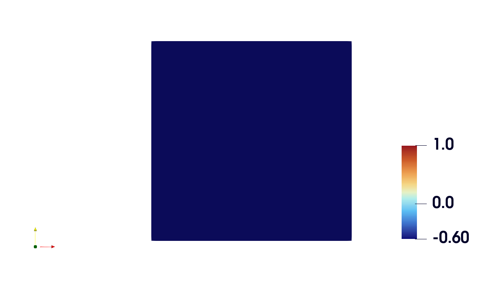
  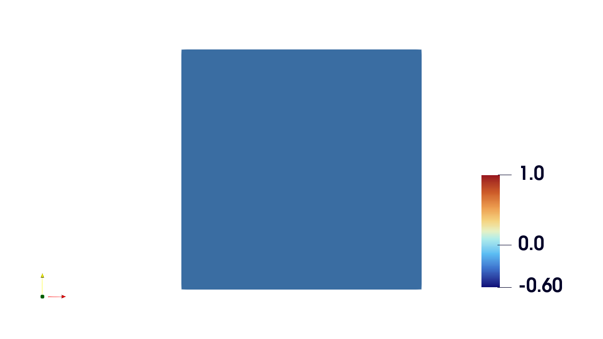
  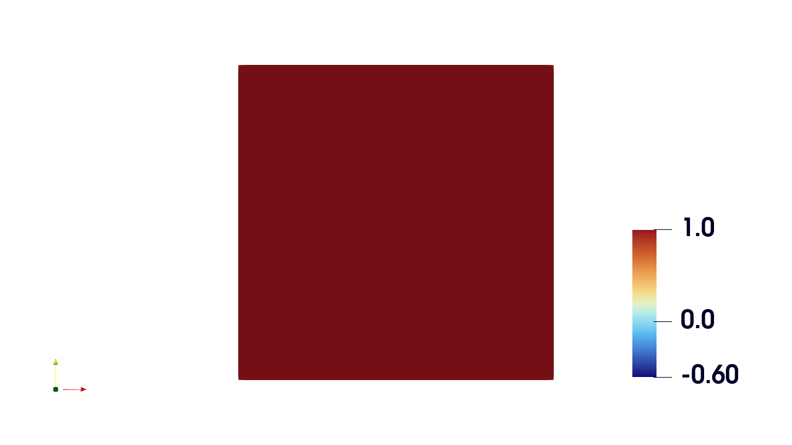
</p>

### Main files

- `Task0/task_0.py` — local phase-field solver
- `Task0/Testfvsphi.py` — free-energy verification
- `Task0/README.md` — detailed test description
- `Task0/output/` — selected results

---

## Task 1 — Gradient Energy and Flat-Interface Motion

### Objective

Introduce the gradient-energy contribution and verify the behavior of a diffuse
interface.

The isotropic phase-field equation becomes

$$
\tau_0\dot{\phi}
=
-\mu,
$$

with

$$
\mu
=
\frac{\partial f}{\partial\phi}
-
\lambda_0^2\nabla^2\phi.
$$

The test examines:

- formation of a diffuse interface,
- evolution of the total free energy,
- flat-interface propagation,
- interface position,
- interface velocity,
- interface thickness,
- sensitivity to temporal and spatial discretization.

### Energy evolution

<p align="center">
  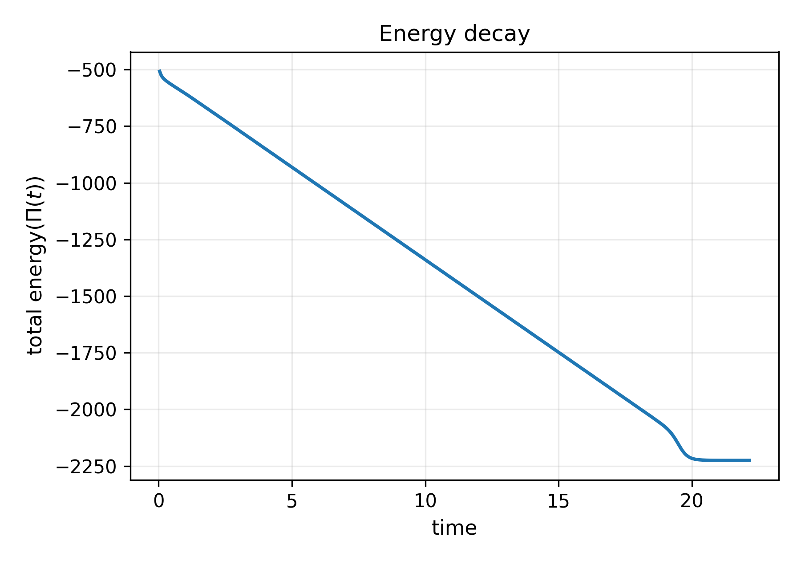
</p>

### Interface motion

<p align="center">
  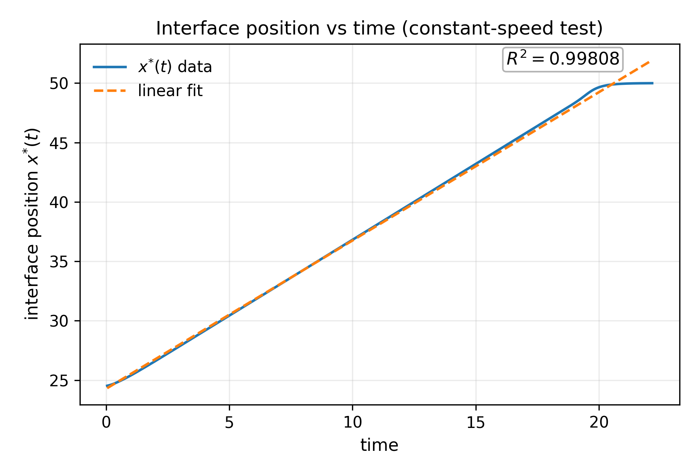
  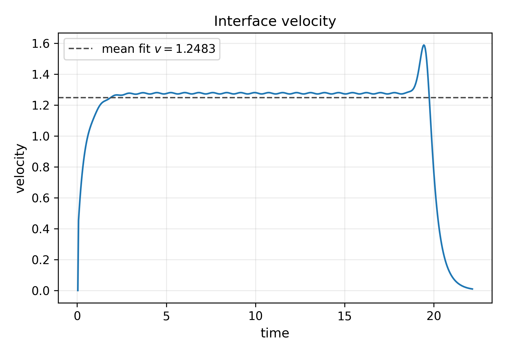
</p>

### Interface thickness

<p align="center">
  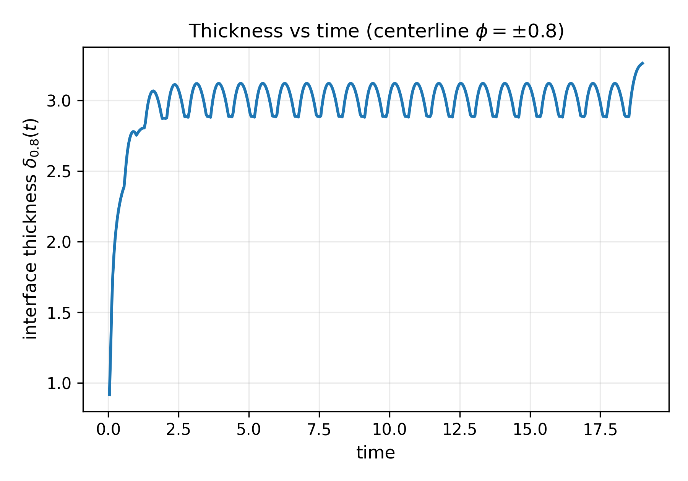
</p>

### Main files

- `Task1/task_1.py` — phase-field solver with gradient energy
- `Task1/Test 1/` — flat-interface verification
- `Task1/Outputs/` — verification plots and CSV data

---

## Task 2 — Coupled Phase Field and Diffusion

### Objective

Introduce the second field $u$ and solve the coupled $\phi-u$ problem using a
mixed finite-element formulation.

The phase residual includes

$$
R_{\phi}
=
\int_{\Omega}
\tau_0(\phi-\phi_0)w_{\phi}
\,d\Omega
+
\Delta t
\int_{\Omega}
\frac{\partial f}{\partial\phi}
w_{\phi}
\,d\Omega
+
\Delta t\lambda_0^2
\int_{\Omega}
\nabla\phi\cdot\nabla w_{\phi}
\,d\Omega.
$$

The diffusion residual used in this stage is

$$
R_u
=
\int_{\Omega}
\left[
(u-u_0)
-
\frac{1}{2}(\phi-\phi_0)
\right]
w_u
\,d\Omega
+
\Delta t D
\int_{\Omega}
\nabla u\cdot\nabla w_u
\,d\Omega.
$$

### Verification

The coupled implementation is tested using:

- total free-energy evolution,
- dissipation behavior,
- enthalpy balance,
- coupling consistency,
- homogeneous Neumann boundary conditions.

### Selected results

<p align="center">
  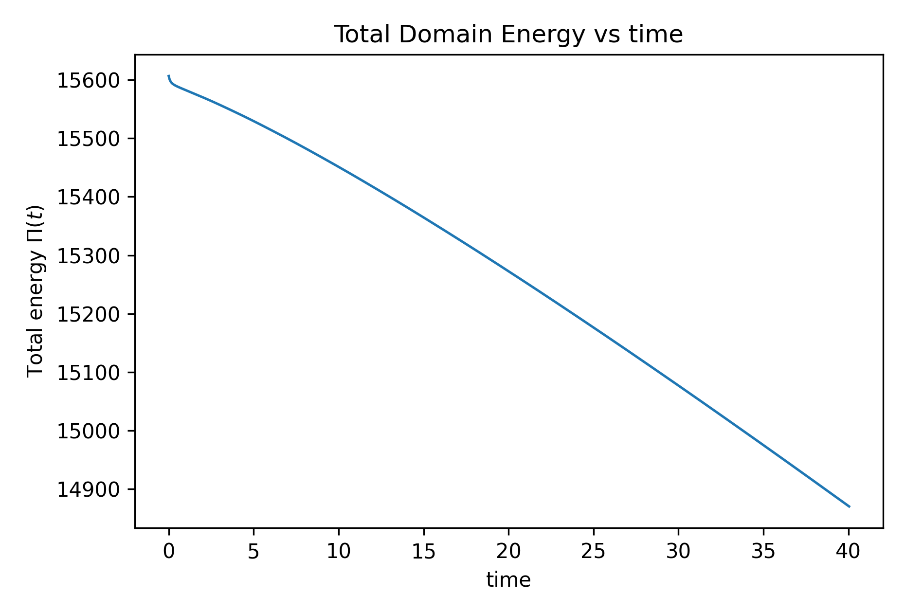
  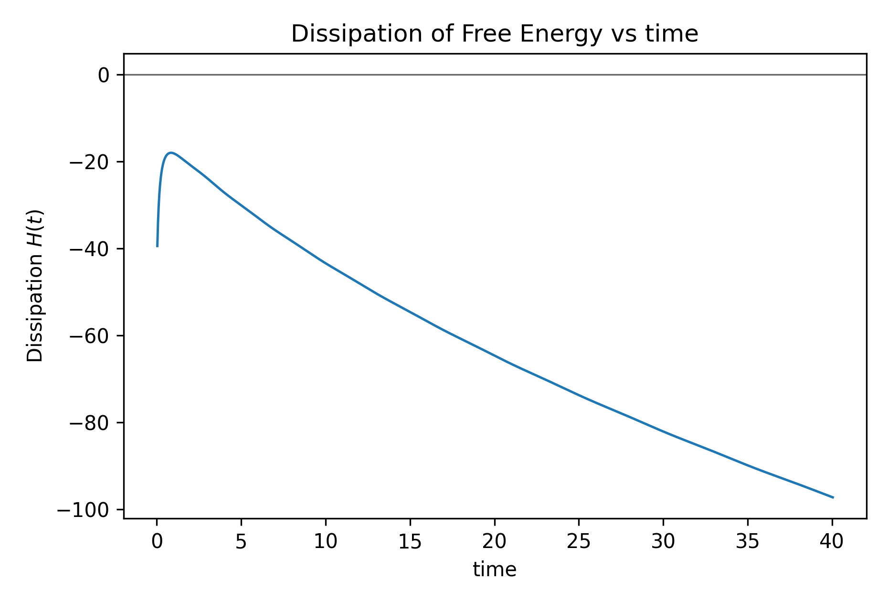
</p>

<p align="center">
  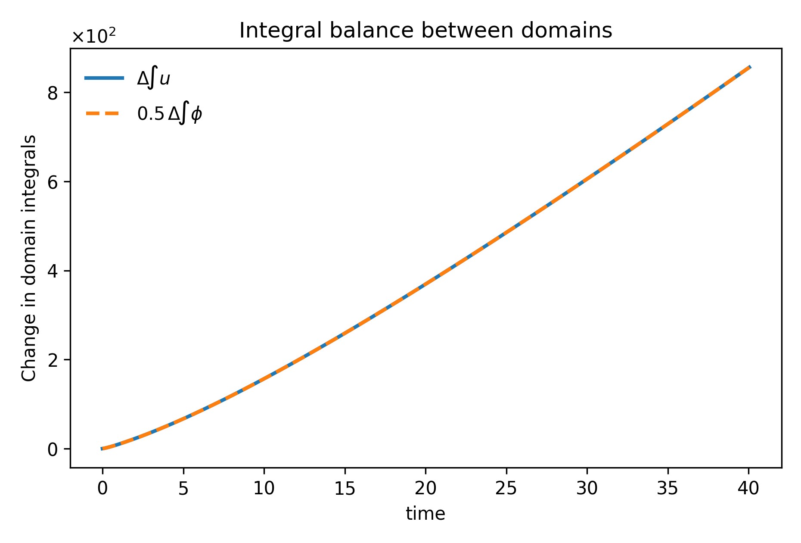
  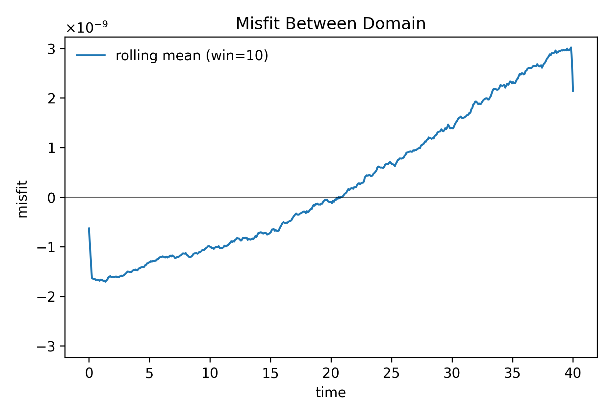
</p>

### Representative fields

<p align="center">
  
  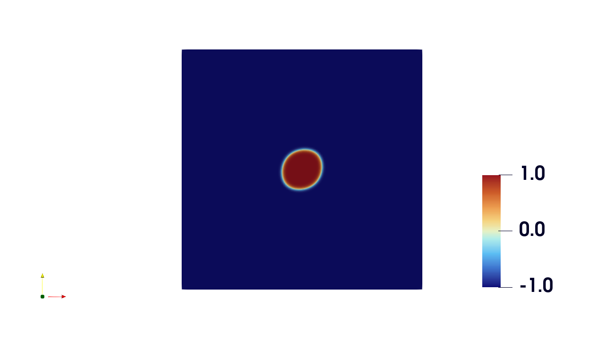
  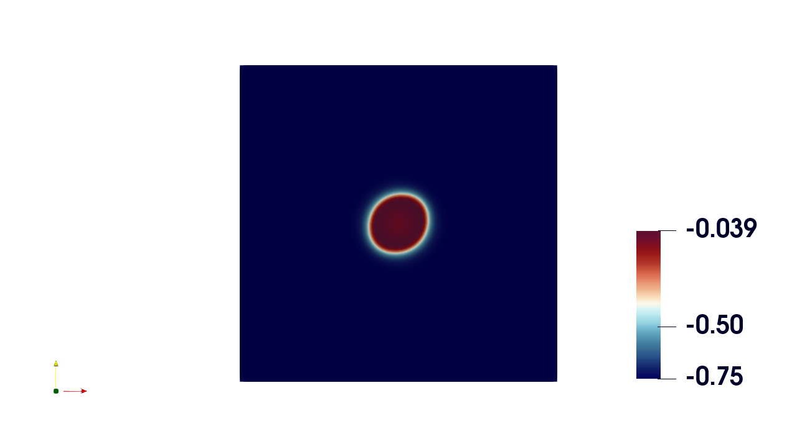
</p>

### Main files

- `Task_2/task_2.py` — monolithic coupled solver
- `Task_2/Test/test2.py` — thermodynamic diagnostics
- `Task_2/Test/test_bc.py` — zero-flux boundary-condition verification
- `Task_2/Test/README.md` — verification documentation
- `Task_2/out_task2/` — selected numerical results

---

## Task 3 — Four-Fold Anisotropy and Dendritic Growth

### Objective

Extend the phase-field formulation with four-fold interfacial anisotropy and
investigate dendritic growth from an initially circular seed.

The final solver includes:

- mixed $\phi-u$ finite-element space,
- implicit Backward-Euler integration,
- Newton nonlinear solution,
- anisotropic interfacial flux,
- interface-normal regularization,
- circular diffuse-interface seed,
- small initial interface perturbation,
- dendrite-tip post-processing.

### Important note on the provided benchmark

The final solver retains the complete $\phi-u$ formulation, but the parameter set
used in the current anisotropy benchmark is

$$
\zeta = 0,
\qquad
K = 0.
$$

Therefore, phase-temperature and latent-heat coupling are disabled for this specific
benchmark.

This allows the anisotropic phase-field contribution to be examined independently
after the coupled formulation has already been verified in **Task 2**.

---

## Dendrite Evolution

<p align="center">
  
  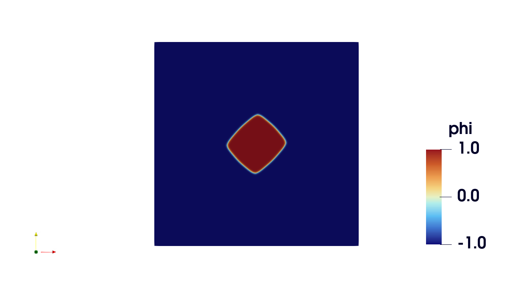
  
  
</p>

### Phase-field interface

<p align="center">
  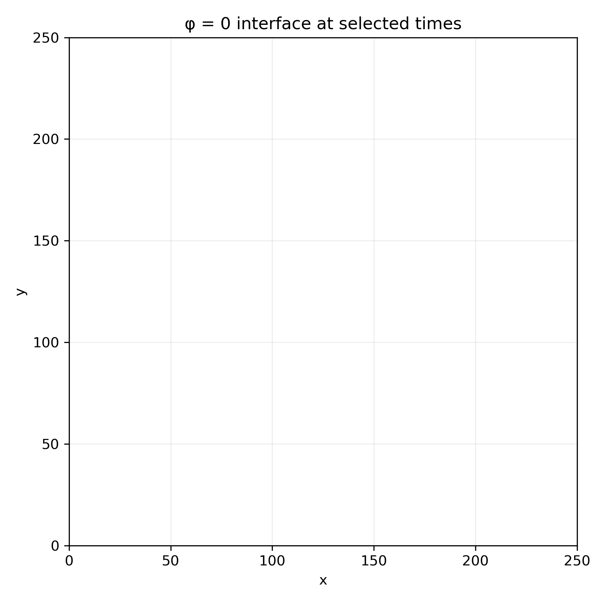
</p>

---

# Dendrite-Tip Tracking

The dendrite-tip position is determined from the $\phi=0$ interface.

For each stored state, the post-processing procedure identifies the furthest
interface point along the selected growth direction.

This provides the tip-position history

$$
x_{\mathrm{tip}}(t).
$$

The instantaneous or fitted dendrite-tip velocity is then obtained from

$$
v_{\mathrm{tip}}
=
\frac{d x_{\mathrm{tip}}}{dt}.
$$

### Tip-velocity result

<p align="center">
  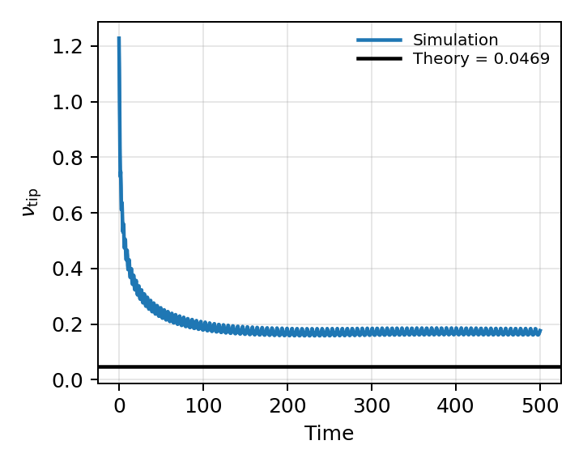
</p>

The numerical tip coordinates are also stored in `tip_trace.csv` for additional
analysis.

---

# Additional Decoupling Tests

The final-stage test directory also contains independent checks of the individual
governing equations.

### Diffusion-only test

The phase field is frozen while the $u$ field evolves.

This isolates the diffusion equation and verifies the implicit diffusion operator
and zero-flux boundary conditions.

### Phase-field-only test

The $u$ field is held constant while $\phi$ evolves.

This isolates the nonlinear phase-field and curvature-driven interface evolution.

These tests help separate errors in individual physical operators from errors in
the fully assembled nonlinear system.

---

# Verification Strategy

| Stage | Added physics / numerics | Main verification |
|---|---|---|
| **Task 0** | Bulk free energy | Numerical trajectory vs. free-energy landscape |
| **Task 1** | Gradient energy | Energy decay, interface velocity, interface thickness |
| **Task 2** | $\phi-u$ coupling | Energy, dissipation, enthalpy balance, zero-flux BCs |
| **Task 3** | Four-fold anisotropy | Preferred growth morphology and tip kinetics |

The central philosophy of the project is:

> **build → isolate → verify → couple → verify again**

rather than moving directly to the final morphology without checking the
individual terms of the model.

---

# Parameters of the Current Final Benchmark

The current `Final.py` simulation uses the following representative parameter set:

| Parameter | Value |
|---|---:|
| Domain size | $250 \times 250$ |
| Mesh divisions | $250 \times 250$ |
| Time step $\Delta t$ | $0.04$ |
| Total simulated time | $200$ |
| $\tau_0$ | $1.0$ |
| $\lambda_0$ | $1.0$ |
| $D$ | $1.0$ |
| Initial $u_0$ | $-0.65$ |
| Initial seed radius $r_0$ | $5.0$ |
| Anisotropy $\epsilon$ | $0.05$ |
| $\zeta$ | $0$ |
| $K$ | $0$ |

A diffuse circular initial interface is prescribed using

$$
\phi(r,0)
=
\tanh
\left(
\frac{r_0-r}{\sqrt{2}\lambda_0}
\right).
$$

A small perturbation is introduced near the interface to allow anisotropic
morphological evolution to develop.

---

# Repository Structure

```text
PPP/
│
├── README.md
│
├── Final.py
│├── PPP.pdf
│
├── Task0/
│   ├── task_0.py
│   ├── Testfvsphi.py
│   ├── README.md
│   └── output/
│
├── Task1/
│   ├── task_1.py
│   ├── Test 1/
│   └── Outputs/
│
├── Task_2/
│   ├── task_2.py
│   ├── Test/
│   │   ├── test2.py
│   │   ├── test_bc.py
│   │   └── README.md
│   └── out_task2/
│
└── Task_3/
    ├── Final.py
    ├── Test/
    │   ├── Test_f1.py
    │   ├── Test_f2.py
    │   ├── tipvelocity.py
    │   └── README.md
    │
    └── outputs/
        ├── 1/
        └── 2/
```

---

# Software Stack

### Numerical implementation

- Python
- FEniCSx / DOLFINx
- UFL
- Basix
- PETSc
- petsc4py
- MPI
- mpi4py
- NumPy

### Post-processing and visualization

- Matplotlib
- PyVista
- PyVistaQt
- OpenPyXL
- ParaView

---

# Running the Final Solver

A working FEniCSx environment with PETSc and MPI is required.

From the `PPP` directory:

```bash
python Final.py
```

For an MPI run:

```bash
mpirun -np 4 python Final.py
```

The number of MPI processes can be adjusted according to the available hardware.

---

# Running the Development Stages

## Task 0

```bash
cd Task0
python task_0.py
python Testfvsphi.py
```

---

## Task 1

```bash
cd Task1
python task_1.py
```

Additional verification scripts are contained in:

```text
Task1/Test 1/
```

---

## Task 2

```bash
cd Task_2
python task_2.py
```

The associated diagnostics verify the coupled formulation and boundary conditions.

---

## Task 3

```bash
cd Task_3
python Final.py
```

The corresponding verification and post-processing scripts are available in:

```text
Task_3/Test/
```

---

# Simulation Output

The simulations generate field data using FEniCSx XDMF/HDF5 output.

Raw field histories can become very large. For example, fine-mesh transient
simulations may produce HDF5 files of several hundred megabytes.

For this reason, large generated field files are intentionally excluded from this
GitHub repository.

The repository instead contains selected:

- phase-field snapshots,
- interface contours,
- temperature-field snapshots,
- dendrite evolution results,
- energy histories,
- dissipation histories,
- balance diagnostics,
- interface-position histories,
- tip-position CSV files,
- dendrite-tip velocity plots.

This keeps the repository lightweight while retaining the important numerical
evidence and verification results.

---

# Technical Report

A more detailed description of the mathematical formulation, implementation,
verification procedure, and numerical results is available in:

**[PPP.pdf](PPP.pdf)**

---

# Reference Model

The phase-field formulation and dendritic-solidification benchmark were developed
with reference to:

> **Modeling of dendritic solidification and numerical analysis of the phase-field approach to model complex morphologies in alloys**

The present repository represents an independent **FEniCSx finite-element
implementation and verification workflow** based on the mathematical model studied
in that work.

---

# Project Context

This project was developed as a **Personal Programming Project (PPP)** within the
M.Sc. Computational Materials Science program at **TU Bergakademie Freiberg**.

The emphasis of the work is not only generation of dendritic morphologies, but also
the numerical implementation and systematic verification of the underlying
phase-field equations.

---

# Author

**Kartik Suresh Tandel**

M.Sc. Computational Materials Science  
TU Bergakademie Freiberg

**Areas of interest**

- Computational Mechanics
- Computational Materials Science
- Finite Element Methods
- Phase-Field Modeling
- Nonlinear Numerical Methods
- Multiphysics Simulation
- Scientific Computing