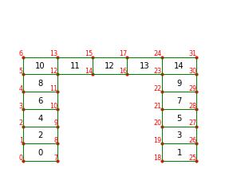

# Computational Mechanics & Materials Simulation Portfolio

A collection of numerical simulation, finite element, computational mechanics,
and computational materials science projects developed using **Python,
FEniCSx, PETSc, MPI, NumPy, SciPy**, and related scientific-computing tools.

The repository contains implementations developed to understand numerical methods
from the governing equations through discretization, solver implementation,
verification, and post-processing.

**Computational Mechanics · Finite Element Analysis · Phase-Field Modeling · Nonlinear FEM · Structural Dynamics · Material Modeling · Scientific Computing**

---

## About This Repository

This repository serves as a technical portfolio of projects in computational
mechanics and computational materials science.

The projects focus on implementing numerical methods rather than only using
commercial simulation software.

Typical topics include:

- finite element formulation,
- nonlinear finite element analysis,
- constitutive material modeling,
- phase-field methods,
- microstructure evolution,
- nonlinear solution algorithms,
- structural dynamics,
- modal analysis,
- numerical verification,
- scientific programming,
- simulation post-processing.

Each major project is maintained in its own folder with a dedicated `README.md`
containing the theory, numerical formulation, implementation details,
verification, and representative results.

---

# Projects

## 1. Phase-Field Modeling of Dendritic Solidification

**Folder:** [`PPP/`](PPP/)

**Technologies:** FEniCSx · DOLFINx · PETSc · MPI · Python · UFL · NumPy

Finite-element implementation and numerical verification of a phase-field model
for dendritic solidification.

The project progressively develops the formulation from local phase evolution to
gradient-energy effects, coupled phase-field/diffusion equations, and finally
four-fold anisotropic dendritic growth.

### Main Topics

- phase-field modeling,
- dendritic solidification,
- diffuse-interface methods,
- nonlinear finite elements,
- mixed finite-element formulations,
- Backward-Euler time integration,
- Newton nonlinear solution,
- PETSc solvers,
- MPI-compatible simulation,
- thermodynamic verification,
- anisotropic interface energy,
- dendrite-tip tracking.

<p align="center">
  
  
  
</p>

<p align="center">
  <b>Evolution of an initially circular phase-field seed into an anisotropic dendritic morphology</b>
</p>

### Development Strategy

The implementation was developed through four progressive stages:

```text
Task 0
Bulk free-energy verification
        │
        ▼
Task 1
Gradient energy and interface motion
        │
        ▼
Task 2
Coupled phase-field and diffusion model
        │
        ▼
Task 3
Four-fold anisotropy and dendritic growth
```

Verification includes energy evolution, dissipation, enthalpy balance,
zero-flux boundary conditions, interface motion, and dendrite-tip kinetics.

**[View the complete project →](PPP/)**

---

## 2. Nonlinear Finite Element Analysis of a Viscoplastic Bar

**Folder:** [`NLFEM/`](NLFEM/)

**Technologies:** Python · NumPy · Matplotlib · Nonlinear FEM · Newton-Raphson

A self-written nonlinear finite-element solver for the incremental analysis of a
one-dimensional two-segment bar with rate-dependent viscoplastic material
behavior.

The implementation covers the complete nonlinear finite-element workflow from
the material routine through the global equilibrium solution.

### Main Topics

- finite elements from first principles,
- two-node bar elements,
- numerical Gauss integration,
- viscoplastic constitutive modeling,
- internal-variable evolution,
- tangent material stiffness,
- element internal-force calculation,
- global stiffness assembly,
- nonlinear equilibrium,
- Newton-Raphson iteration,
- incremental loading,
- mesh/discretization analysis.

<p align="center">
  
</p>

### Solver Structure

```text
Material Routine
      │
      ▼
Element Formulation
      │
      ▼
Global Assembly
      │
      ▼
Residual Evaluation
      │
      ▼
Newton-Raphson Solver
      │
      ▼
Stress / Strain / Force Results
```

This project demonstrates the implementation of the major components required
for nonlinear structural finite-element analysis without relying on an external
FE solver.

**[View the complete project →](NLFEM/)**

---

## 3. Finite Element Modal Analysis of a 2D Structure

**Folder:** [`RSJC/`](RSJC/)

**Technologies:** Python · NumPy · SciPy · pandas · Matplotlib · FEM

A two-dimensional finite-element implementation for structural modal analysis.

The structural geometry, element connectivity, material properties, and element
geometry are read from external CSV files. The solver assembles the global
stiffness and mass matrices and solves the generalized eigenvalue problem to
determine natural frequencies and vibration mode shapes.

### Main Topics

- structural dynamics,
- modal analysis,
- quadrilateral finite elements,
- bilinear interpolation,
- Jacobian transformations,
- Gaussian integration,
- global stiffness assembly,
- global mass assembly,
- matrix verification,
- structural boundary conditions,
- generalized eigenvalue problems,
- mode-shape visualization.

<p align="center">
  
</p>

### Analysis Workflow

```text
CSV Model Input
      │
      ▼
Finite Element Mesh
      │
      ▼
Element K and M Matrices
      │
      ▼
Global Matrix Assembly
      │
      ▼
Boundary Conditions
      │
      ▼
Generalized Eigenvalue Problem
      │
      ▼
Natural Frequencies
      │
      ▼
Mode Shapes
```

**[View the complete project →](RSJC/)**

---

# Project Overview

| Project | Main Area | Numerical Methods | Main Tools |
|---|---|---|---|
| [`PPP`](PPP/) | Dendritic solidification | Phase field, nonlinear FEM, implicit time integration | FEniCSx, PETSc, MPI, Python |
| [`NLFEM`](NLFEM/) | Nonlinear structural mechanics | Newton-Raphson, constitutive integration, FEM | Python, NumPy |
| [`RSJC`](RSJC/) | Structural dynamics | Modal FEM, generalized eigenvalue analysis | Python, SciPy, NumPy |

---

# Technical Areas

The projects in this repository cover several areas of computational engineering.

### Finite Element Methods

Implementation of finite-element concepts including:

- shape functions,
- strain-displacement matrices,
- Jacobian transformations,
- numerical quadrature,
- element matrices,
- global matrix assembly,
- boundary conditions,
- nonlinear residuals.

### Nonlinear Computational Mechanics

Implementation of:

- nonlinear equilibrium equations,
- Newton-Raphson iterations,
- tangent stiffness matrices,
- constitutive updates,
- incremental loading,
- internal state variables.

### Computational Materials Science

Applications involving:

- phase transformations,
- diffuse-interface modeling,
- dendritic solidification,
- microstructure evolution,
- thermodynamic driving forces,
- interfacial anisotropy.

### Structural Dynamics

Implementation of:

- mass and stiffness matrices,
- free-vibration problems,
- generalized eigenvalue analysis,
- natural frequencies,
- vibration mode shapes.

---

# Numerical Verification

An important objective across these projects is not only obtaining a numerical
solution, but checking whether the implementation behaves as expected.

Depending on the project, verification includes:

- mesh/discretization studies,
- time-step studies,
- Newton convergence,
- energy evolution,
- dissipation behavior,
- conservation/balance checks,
- boundary-condition checks,
- comparison with analytical behavior,
- simplified or decoupled test cases.

This reflects the principle that numerical simulation results should be supported
by verification of the implemented formulation.

---

# Software & Tools

### Programming and Scientific Computing

- Python
- NumPy
- SciPy
- pandas
- Matplotlib

### Finite Element & Parallel Computing

- FEniCSx
- DOLFINx
- UFL
- PETSc
- petsc4py
- MPI
- mpi4py

### Visualization & Post-Processing

- Matplotlib
- PyVista
- ParaView

---

# Repository Structure

```text
Projects/
│
├── README.md
│
├── .gitignore
│
├── PPP/
│   ├── README.md
│   ├── Final.py
│   ├── Task0/
│   ├── Task1/
│   ├── Task_2/
│   └── Task_3/
│
├── NLFEM/
│   ├── README.md
│   ├── PVL.py
│   ├── NLFEM_report.pdf
│   └── results
│
└── RSJC/
    ├── README.md
    ├── Final_code.py
    ├── node_details.csv
    ├── element_connectivity.csv
    ├── GeometryDetails.csv
    └── reinforced_concrete_properties.csv
```

Each project folder is designed to be understandable independently and contains
its own project-specific documentation.

---

# Repository Growth

This repository is maintained as an **evolving portfolio** of computational
mechanics, finite-element, materials simulation, and scientific-computing work.

The three projects currently documented here represent the present contents of
the repository. **Additional project folders may be added over time** as new
numerical methods, simulation workflows, academic projects, and research-oriented
implementations are completed.

The repository structure is therefore intentionally extensible:

```text
Projects/
│
├── README.md
│
├── Existing_Project_1/
├── Existing_Project_2/
├── Existing_Project_3/
│
├── Future_Project_1/
├── Future_Project_2/
└── ...
```

When a new major project is added, it should ideally contain:

```text
New_Project/
│
├── README.md
├── source code
├── input data
├── selected results
└── documentation
```

The root `README.md` will be updated to include a short description and link to
each completed project.

This approach allows the repository to develop continuously while keeping the
individual projects organized and independently documented.

---

# Purpose of the Portfolio

The repository demonstrates the progression from mathematical and physical
models to working computational implementations.

The emphasis is on understanding the complete simulation workflow:

```text
Physical Problem
      │
      ▼
Governing Equations
      │
      ▼
Numerical Formulation
      │
      ▼
Implementation
      │
      ▼
Solver
      │
      ▼
Verification
      │
      ▼
Post-Processing
      │
      ▼
Engineering / Materials Interpretation
```

The projects therefore complement experience with established engineering
simulation software by demonstrating implementation-level understanding of the
underlying numerical methods.

---

# Author

**Kartik Suresh Tandel**

M.Sc. Computational Materials Science  
TU Bergakademie Freiberg

### Technical Interests

- Computational Mechanics
- Finite Element Analysis
- Nonlinear FEM
- Constitutive Material Modeling
- Phase-Field Modeling
- Computational Materials Science
- Structural Dynamics
- Multiphysics Simulation
- Scientific Computing